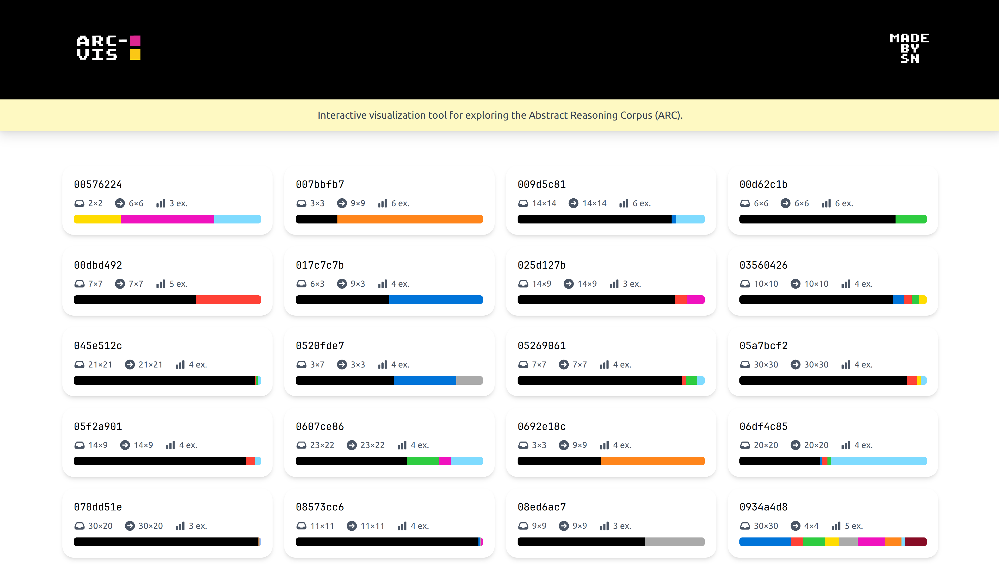

# ARC-VIS: ARC Visualization Tool

<!-- [](https://deepwiki.com/superflash41/arc-vis) -->

<div align="center">
  <a href="https://deepwiki.com/superflash41/arc-vis">
    
  </a>
</div>

## Overview

ARC-VIS is a visualization tool for the *Abstract Reasoning Corpus* (ARC), a collection of grid-based reasoning tasks designed to challenge reasoning and generalization abilities of AI systems. 

The application shows a simple visual representation of the different ARC tasks. For each task, it displays a pair example of colored grids.

The goal of this repository is to allow:
- Visualization of the grid-based tasks with appropriate colors
- Exploration of the input-output relationships
- Understanding of the structure and complexity of different tasks

## About the Dataset
The ARC dataset consists of 7,784 tasks, each with a unique grid-based input and output. The tasks are divided into two categories: *train* and *test*. The training set contains 4,000 tasks, while the test set contains 3,784 tasks. Each task is represented as a grid of colored squares, where the colors are represented by numbers from 0 to 9.

Here is the mapping made in the application:

| Number | 0 | 1 | 2 | 3 | 4 | 5 | 6 | 7 | 8 | 9 |
|--------|---|---|---|---|---|---|---|---|---|---|
| Color  | <span style="display:inline-block;width:20px;height:20px;background-color:black;"></span> | <span style="display:inline-block;width:20px;height:20px;background-color:#0074D9;"></span> | <span style="display:inline-block;width:20px;height:20px;background-color:#FF4136;"></span> | <span style="display:inline-block;width:20px;height:20px;background-color:#2ECC40;"></span> | <span style="display:inline-block;width:20px;height:20px;background-color:#FFDC00;"></span> | <span style="display:inline-block;width:20px;height:20px;background-color:#AAAAAA;"></span> | <span style="display:inline-block;width:20px;height:20px;background-color:#F012BE;"></span> | <span style="display:inline-block;width:20px;height:20px;background-color:#FF851B;"></span> | <span style="display:inline-block;width:20px;height:20px;background-color:#7FDBFF;"></span> | <span style="display:inline-block;width:20px;height:20px;background-color:#870C25;"></span> |

More detail on the benchmark's official [repository](https://github.com/fchollet/ARC-AGI).

## Usage

To use the application just go to this [website](https://superflash41.github.io/arc-vis/), and to run it locally clone the repository and use the following commands:

```bash
cd arc-vis/f
bun install
bun run dev
```

## License

This project is licensed under the MIT License.
